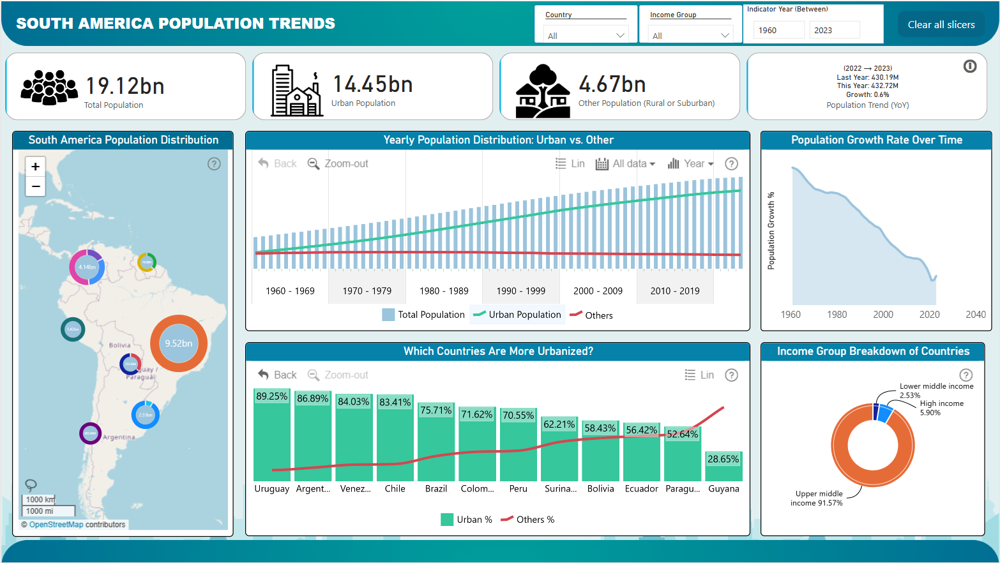

# Challenge Overview
I participated in the Onyx Data February 2025 Challenge, which focused on analyzing South American demographic and urbanization trends. The goal was to provide insights that support effective urban planning and sustainable growth.

As urbanization continues to rise globally, understanding demographic trends is crucial for sustainable development. This challenge provided an opportunity to explore how urban populations are growing, which regions are experiencing rapid changes, and the implications of these shifts for infrastructure and economic planning.

# Key Findings:

- Urbanization vs. Other Population Groups – The data shows an inverse relationship between urbanization and other population groups. As cities expand and urbanization rates climb while the rural populations decline.

- Urban Population (% of Total Population): 75.57%

- Urban Population (Absolute Numbers): 14.45 billion

- Most & Least Urbanized Countries – Uruguay (89%) and Chile (83%) are the most urbanized nations, showing strong city-based development. Interestingly, Guyana stands out with only 28% urbanization rate only.

- Total Population of South America: 19.12 billion

These insights reveal a significant concentration of population in urban areas, indicating the need for enhanced infrastructure, housing, transportation, and public services to accommodate this growth. Countries such as Uruguay, Argentina, and Venezuela are experiencing particularly high urbanization rates, highlighting the urgency of sustainable urban planning initiatives in these regions.

# Data Source
The dataset was obtained from the World Bank: https://data.worldbank.org/topic/19.

# Structure
- Dataset: Raw data
- SA-Dashboard: Main dashboard pbix
- Asset: Contains Images of formulas and dashboard
